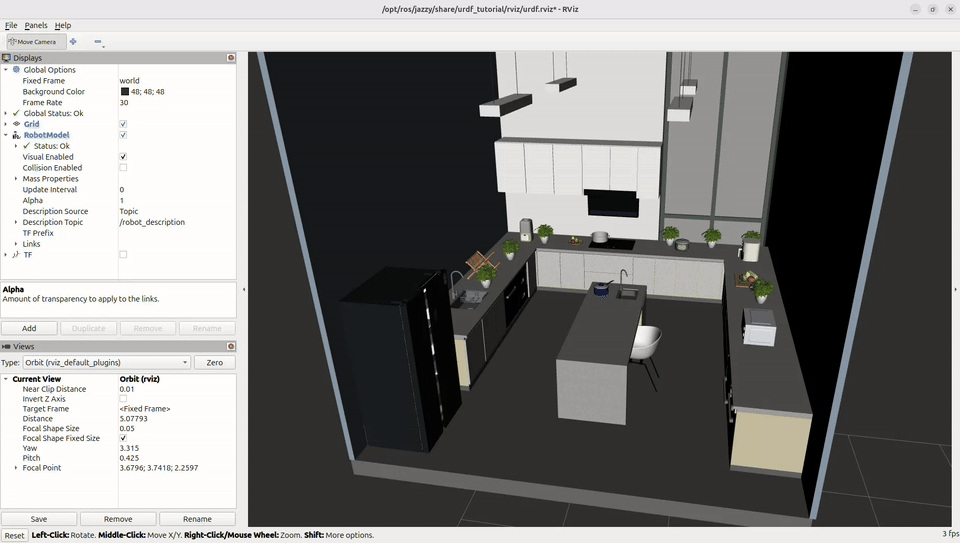
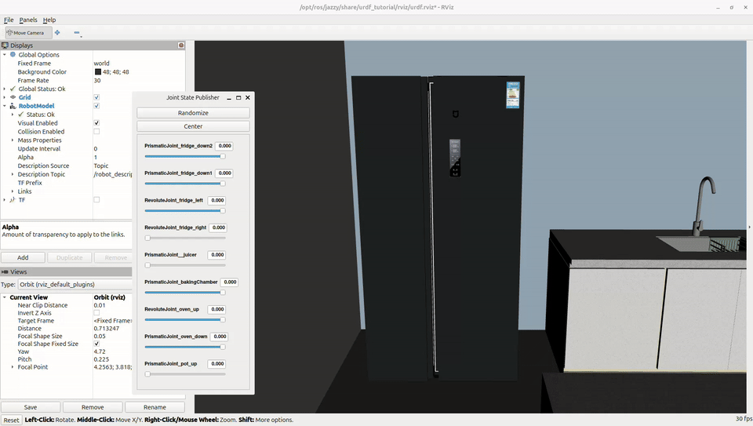

# USD to URDF Converter

Convert OpenUSD assets or scenes (`.usd`, `.usda`, `.usdc`) to URDF.

## Features

- Supports `fixed`, `revolute`, and `prismatic` joints.
- Supports multiple articulation roots within the same scene.
- Preserves the `q = 0` pose from USD.
- Handles scale, non-uniform scale, and reflection by baking affine transforms into meshes.
- Automatically recalculates joint axis direction when needed.
- Visual meshes: `OBJ + MTL + texture`.
- Collision meshes: `STL`.
- Static meshes that do not belong to any rigid body are grouped into `scene_static`.
- Optional automatic grounding for the entire scene.
- Generates `conversion_report.json` containing joint, affine, and material diagnostic information.

## Requirements

Ubuntu + Python 3 with OpenUSD Python bindings:

```bash
source ~/hf_env/bin/activate

python3 -c "from pxr import Usd, UsdGeom, UsdPhysics, UsdShade; print('USD OK')"
```

If OpenUSD is not installed:

```bash
python3 -m pip install usd-core
```

ROS 2 is not required for the conversion process. The RViz section below is only provided for users who want to visualize the converted URDF model in 3D.

## Configuration

Open `usd_to_urdf.py` and modify the `CONFIG` section at the beginning of the file:

```python
USD_PATH = ("/path/to/input/model.usd")

OUTPUT_DIR = Path("/path/to/output")
```

Example for a single asset:

```python
USD_PATH = "/home/tracy/ArtVIP/Articulated_objects/large_furniture/cupboard/cupboard_1/model_cupboard_1.usd"

OUTPUT_DIR = "/home/tracy/converted/cupboard_1"
```

Main options:

```python
ADD_WORLD_LINK = True

AUTO_GROUND = True

EXPORT_MATERIALS = True

COPY_TEXTURES = True
```

## Download an ArtVIP Scene

Example: download the complete kitchen scene:

```bash
source ~/hf_env/bin/activate

hf download X-Humanoid/ArtVIP   --repo-type dataset   --include "Scenes/kitchen/**"   --local-dir ~/ArtVIP
```

Keep the complete scene directory structure because USD files may reference resources located in subdirectories.

## Run the Converter

```bash
cd ~/python_tools/usd_to_urdf

source ~/hf_env/bin/activate

python3 -m py_compile usd_to_urdf.py

python3 usd_to_urdf.py
```

To regenerate the output from scratch:

```bash
rm -rf ~/converted/kitchen

python3 usd_to_urdf.py
```

When the conversion is successful, the output will look like:

```text
CONVERSION COMPLETE

URDF      : .../model.urdf

Visuals   : .../meshes/visual

Collision : .../meshes/collision

Textures  : .../textures

Report    : .../conversion_report.json
```

## Output

```text
converted/kitchen/

├── model.urdf

├── conversion_report.json

├── meshes/

│   ├── visual/

│   │   ├── *.obj

│   │   └── *.mtl

│   └── collision/

│       └── *.stl

└── textures/

    └── ...
```

`model.urdf` contains links, joints, and relative poses.

`meshes/visual` contains the geometry used for visualization.

`meshes/collision` contains collision meshes.

`textures` contains texture files copied from the USD source.

`conversion_report.json` contains diagnostic information about affine transforms, joint axes, anchor errors, and materials.

## Visualize the Converted URDF Model in 3D

Deactivate the virtual environment if it is currently active:

```bash
deactivate
```

Then run:

```bash
source /opt/ros/jazzy/setup.bash

ros2 launch urdf_tutorial display.launch.py   model:=/home/tracy/converted/kitchen/model.urdf
```

In RViz:

```text
Fixed Frame       = world

Visual Enabled    = ✓

Collision Enabled = ☐
```

You can use `joint_state_publisher_gui` to visualize the motion of the joints in the URDF model.

## Important Log Messages

```text
[INFO] Rigid-body links: ...

[INFO] Articulation roots: ...

[INFO] Unowned/static visual meshes: ...

[AXIS] ...

[JOINT] ...
```

`[AXIS]` appears when the joint axis direction in URDF needs to be reversed relative to the original USD axis token.

`AFFINE reflection` or `AFFINE` does not necessarily indicate an error. Affine transformations that cannot be represented directly in URDF are baked into the mesh vertices.

Warnings such as:

```text
MaterialBindingAPI is not applied on the prim
```

normally do not stop the conversion as long as the material can still be resolved.

## Limitations

- Currently supports only `Z-up` stages.
- Supports only `fixed`, `revolute`, and `prismatic` joints.
- URDF requires a tree/forest structure; closed loops or links with multiple parent joints are rejected.
- USD joints connected directly to the world are not used as articulation edges; the converter creates a separate `world` link.
- URDF/RViz cannot represent the full USD PBR material model. Diffuse textures are prioritized, while additional material information is stored in the report.
- Very large scenes may generate large OBJ/STL files and require more time to convert and load.

## Demo

### Full Scene



### Articulated Object

